# 📋 Documentación del Proyecto — Gestor de Horas y Rendimiento Laboral
## Fundación Universitaria María Cano (FUMC)

---

## 📌 Tabla de Contenidos

1. [Retroalimentación de la Visión](#1-retroalimentación-de-la-visión)
2. [Mapa de Impacto](#2-mapa-de-impacto)
3. [Modelo de Dominio](#3-modelo-de-dominio)
   - 3.1 [Muestreo de Datos](#31-muestreo-de-datos)
4. [Mapa de Historias de Usuario](#4-mapa-de-historias-de-usuario)
5. [Modelo de Dominio Enriquecido](#5-modelo-de-dominio-enriquecido)
6. [Modelo de Dominio Anémico](#6-modelo-de-dominio-anémico)
7. [Event Storming](#7-event-storming)
8. [Tallaje del Producto](#8-tallaje-del-producto)
9. [Plan de Liberaciones](#9-plan-de-liberaciones)
10. [Especificación Funcional](#10-especificación-funcional)
11. [Índice de Figuras](#11-índice-de-figuras)
12. [Ciclo de Vida del Software](#12-ciclo-de-vida-del-software)
13. [Metodología Ágil](#13-metodología-ágil)

---

## 1. Retroalimentación de la Visión

### Visión Actual

> *"Para empleados que enfrentan una sobrecarga laboral debido a una mala gestión y priorización de actividades, "Gestor de Horas y Rendimiento Laboral" es una aplicación web que permite visualizar patrones que ayudan a los profesionales encargados de la gestión del desempeño de los empleados a identificar las causas raíces de la baja productividad. A diferencia de Trello, Asana, Monday, ClickUp, Jira y Bitrix24, nuestro producto organiza esta información de forma tal que el profesional pueda analizar en conjunto con el empleado, el impacto de cada actividad, proporcionando información clave para tomar decisiones estratégicas y mejorar la productividad sin incrementar la carga de trabajo."*

### ✅ Evaluación: **Buena — con observaciones menores**

| Criterio | Evaluación | Comentario |
|---|---|---|
| **¿Para quién?** | ✅ Claro | Define dos audiencias: empleados (problema) y profesionales de gestión del desempeño (usuarios directos) |
| **¿Qué problema resuelve?** | ✅ Claro | Sobrecarga laboral por mala gestión y priorización |
| **¿Qué es?** | ✅ Claro | Aplicación web de visualización de patrones de rendimiento |
| **Diferenciación competitiva** | ✅ Fuerte | Se distingue claramente de 6 competidores conocidos |
| **Propuesta de valor** | ✅ Precisa | Analizar impacto por actividad, decisiones estratégicas sin incrementar carga |

**Sugerencias de mejora (opcionales, no obligatorias):**
- Podrían mencionar el **modelo de 5 fases** como elemento diferenciador metodológico, ya que ninguno de los competidores mencionados implementa un flujo secuencial de evaluación con cálculo automático de prioridades e impacto temporal.
- Considerar agregar la palabra "**institucional**" o "**organizacional**" para acotar el contexto (ej: *"para organizaciones cuyos empleados enfrentan..."*), ya que refuerza que es una herramienta de gestión corporativa, no personal.

---

## 2. Mapa de Impacto

El Mapa de Impacto conecta los **objetivos de negocio** con los **entregables del producto** a través de los actores que generan los impactos necesarios para alcanzarlos.

### 2.1 Diagrama General

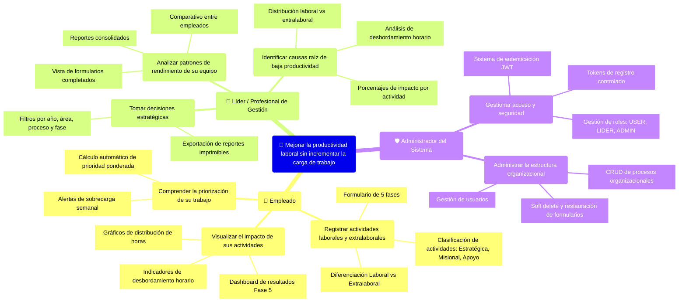

### 2.2 Desglose Detallado del Mapa de Impacto

#### 🎯 Objetivo de Negocio

> **Mejorar la productividad laboral de los empleados sin incrementar su carga de trabajo**, proporcionando herramientas analíticas que permitan identificar patrones de sobrecarga y tomar decisiones informadas sobre la distribución de actividades.

---

#### 👤 Actor 1: Empleado

| Impacto | Entregables |
|---|---|
| **Registrar y categorizar sus actividades** | • Formulario de evaluación en 5 fases secuenciales |
| | • Clasificación por tipo: Estratégica, Misional, Apoyo |
| | • Separación Laboral vs Extralaboral |
| | • Configuración de horario semanal (horas laborales y extralaborales) |
| **Visualizar el impacto real de sus actividades** | • Dashboard de resultados (Fase 5) con 4 pestañas: Resumen, Porcentajes, Gráficos, Detalle |
| | • Gráficos de barras de distribución de horas anuales |
| | • Indicadores visuales de desbordamiento horario semanal |
| | • Cálculo automático del tiempo anualizado por frecuencia |
| **Comprender la priorización de su trabajo** | • Score de prioridad ponderado (Importancia 50%, Coherencia 30%, Relevancia 20%) |
| | • Clasificación automática: Alta (≥4.0), Media (≥2.5), Baja (<2.5) |
| | • Alertas cuando las actividades superan el límite sugerido (20 laborales, 10 extralaborales) |

---

#### 👔 Actor 2: Líder / Profesional de Gestión del Desempeño

| Impacto | Entregables |
|---|---|
| **Analizar patrones de rendimiento del equipo** | • Vista consolidada de todos los formularios completados |
| | • Filtros por año, área, proceso y fase |
| | • Paginación para manejo eficiente de grandes volúmenes |
| **Identificar causas raíz de baja productividad** | • Análisis de desbordamiento: horas semanales vs límite configurado |
| | • Distribución porcentual laboral vs extralaboral |
| | • Porcentaje de impacto de cada actividad sobre el total anual |
| | • Vista previa rápida de formularios sin necesidad de abrirlos |
| **Tomar decisiones estratégicas** | • Reportes imprimibles con formato profesional (A4 horizontal) |
| | • Exportación con detalle de frecuencia, prioridad y horas anuales |
| | • Sección de alerta automática de sobrecarga en reportes |

---

#### 🛡️ Actor 3: Administrador del Sistema

| Impacto | Entregables |
|---|---|
| **Gestionar acceso y seguridad** | • Autenticación con JWT (JSON Web Tokens) |
| | • Tokens de registro de un solo uso para controlar el alta de usuarios |
| | • Tres niveles de roles: USER, LIDER, ADMIN |
| | • Recuperación de contraseña con token temporal (15 min de vigencia) |
| **Administrar la estructura organizacional** | • CRUD completo de procesos organizacionales (con soft delete) |
| | • Gestión completa de usuarios (promover, revocar, eliminar) |
| | • Soft delete de formularios con posibilidad de restauración |
| | • Eliminación permanente solo disponible para admin |
| | • Dashboard de administración con navegación lateral |

---

## 3. Modelo de Dominio

### 3.1 Diagrama de Clases del Dominio

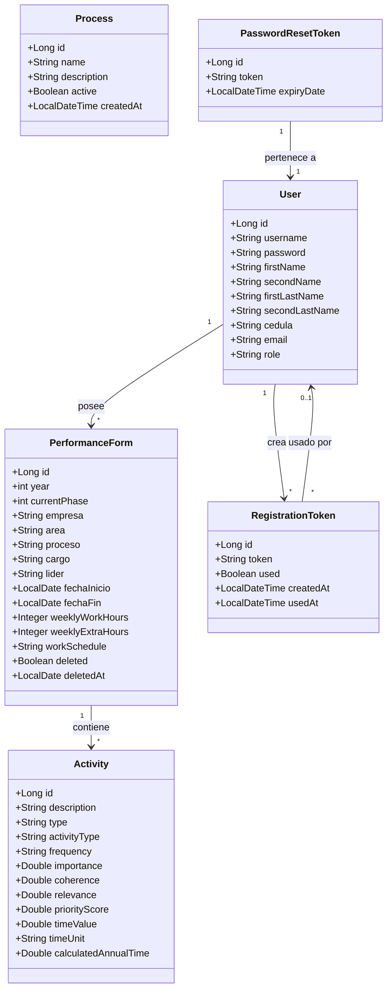

### 3.2 Descripción de Entidades

#### 🟦 User (Usuario)

| Atributo | Tipo | Restricciones | Descripción |
|---|---|---|---|
| `id` | Long | PK, Auto-generado | Identificador único del usuario |
| `username` | String | Único, Not Null | Nombre de usuario para inicio de sesión |
| `password` | String | Not Null, JsonIgnore | Contraseña encriptada (BCrypt) |
| `firstName` | String | Not Null | Primer nombre |
| `secondName` | String | Nullable | Segundo nombre (opcional) |
| `firstLastName` | String | Not Null | Primer apellido |
| `secondLastName` | String | Not Null | Segundo apellido |
| `cedula` | String | Único, Not Null | Número de documento de identidad |
| `email` | String | Único, Not Null | Correo electrónico |
| `role` | String | Not Null | Rol del usuario: `USER`, `LIDER`, `ADMIN` |

**Reglas de negocio del Usuario:**
- Los roles determinan el nivel de acceso: `USER` solo accede a sus formularios, `LIDER` y `ADMIN` acceden a la vista administrativa completa.
- El primer usuario `admin` se crea automáticamente cuando la tabla `users` está vacía.
- Solo `ADMIN` puede acceder a gestión de formatos, usuarios y tokens de registro.

---

#### 🟩 PerformanceForm (Formulario de Evaluación)

| Atributo | Tipo | Restricciones | Descripción |
|---|---|---|---|
| `id` | Long | PK, Auto-generado | Identificador del formulario |
| `user` | User | FK, Not Null | Usuario propietario |
| `year` | int | — | Año de la evaluación |
| `currentPhase` | int | Default 1 (1-5) | Fase actual del formulario |
| `empresa` | String | — | Nombre de la empresa |
| `area` | String | — | Área organizacional |
| `proceso` | String | — | Proceso al que pertenece |
| `cargo` | String | — | Cargo del empleado |
| `lider` | String | — | Nombre del líder |
| `fechaInicio` | LocalDate | — | Fecha de inicio del período |
| `fechaFin` | LocalDate | — | Fecha de fin del período |
| `weeklyWorkHours` | Integer | — | Horas semanales laborales contratadas |
| `weeklyExtraHours` | Integer | — | Horas semanales extralaborales asignadas |
| `workSchedule` | String | — | Horario: "Lunes a Viernes", "Lunes a Sábado", "7/24" |
| `deleted` | Boolean | Default false | Indica si fue eliminado (soft delete) |
| `deletedAt` | LocalDate | — | Fecha del soft delete |

**Modelo de 5 Fases — Flujo Secuencial:**

| Fase | Nombre | Descripción | Datos que se registran |
|---|---|---|---|
| **1** | Registro | Se definen los encabezados del formulario y se crean las actividades | Empresa, área, proceso, cargo, líder, fechas, horario semanal, actividades (descripción, tipo, categoría) |
| **2** | Frecuencia | Se establece con qué frecuencia se realiza cada actividad | Frecuencia y unidad de tiempo de cada actividad |
| **3** | Priorización | Se evalúa la prioridad de cada actividad con criterios ponderados | Importancia (50%), Coherencia (30%), Relevancia (20%) → Cálculo automático del score |
| **4** | Tiempo | Se registra el tiempo dedicado a cada actividad | Valor de tiempo y unidad → Cálculo automático de tiempo anualizado |
| **5** | Resultados | Se visualizan los análisis, gráficos y reportes | Solo lectura — Dashboard analítico con 4 pestañas |

**Restricciones de flujo:**
- Los encabezados solo se editan en Fase 1
- Las actividades solo se agregan/eliminan hasta Fase 2
- Solo se puede retroceder de Fase 2 a Fase 1
- Un administrador puede desbloquear (volver a Fase 1) cualquier formulario

---

#### 🟧 Activity (Actividad)

| Atributo | Tipo | Restricciones | Descripción |
|---|---|---|---|
| `id` | Long | PK, Auto-generado | Identificador de la actividad |
| `form` | PerformanceForm | FK, Not Null | Formulario al que pertenece |
| `description` | String | Not Null | Descripción de la actividad |
| `type` | String | Not Null | Clasificación organizacional: `ESTRATEGICA`, `MISIONAL`, `APOYO` |
| `activityType` | String | Default `LABORAL` | Naturaleza: `LABORAL`, `EXTRALABORAL` |
| `frequency` | String | Fase 2 | Frecuencia de la actividad |
| `importance` | Double | Fase 3, 0-5 | Criterio de importancia (peso: 50%) |
| `coherence` | Double | Fase 3, 0-5 | Criterio de coherencia (peso: 30%) |
| `relevance` | Double | Fase 3, 0-5 | Criterio de relevancia (peso: 20%) |
| `priorityScore` | Double | Calculado | Score = (Imp × 0.50) + (Coh × 0.30) + (Rel × 0.20) |
| `timeValue` | Double | Fase 4 | Valor numérico del tiempo dedicado |
| `timeUnit` | String | Fase 2/4 | Unidad de tiempo: DIA, SEMANA, QUINCENA, MES, TRIMESTRE, SEMESTRE, AÑO |
| `calculatedAnnualTime` | Double | Calculado | Tiempo anualizado = timeValue × factor de conversión |

**Factores de conversión a tiempo anualizado:**

| Unidad | Factor | Fórmula |
|---|---|---|
| DÍA | 258 | 5 días × 4.3 sem × 12 meses |
| SEMANA | 51.6 | 4.3 sem × 12 meses |
| QUINCENA | 24 | 2 × 12 meses |
| MES | 12 | 12 meses |
| TRIMESTRE | 4 | 4 trimestres |
| SEMESTRE | 2 | 2 semestres |
| AÑO | 1 | 1 año |

---

#### 🟪 Process (Proceso Organizacional)

| Atributo | Tipo | Restricciones | Descripción |
|---|---|---|---|
| `id` | Long | PK, Auto-generado | Identificador del proceso |
| `name` | String | Único, Not Null | Nombre del proceso |
| `description` | String | Max 500 chars | Descripción del proceso |
| `active` | Boolean | Default true | Si está activo (soft delete) |
| `createdAt` | LocalDateTime | Auto, No editable | Fecha de creación |

---

#### 🟫 RegistrationToken (Token de Registro)

| Atributo | Tipo | Restricciones | Descripción |
|---|---|---|---|
| `id` | Long | PK, Auto-generado | Identificador del token |
| `token` | String | Único, Not Null, 8 chars | Código alfanumérico generado (UUID truncado) |
| `used` | Boolean | Default false | Si ya fue utilizado |
| `createdBy` | User | FK, Not Null | Administrador que lo generó |
| `createdAt` | LocalDateTime | Auto | Fecha de creación |
| `usedAt` | LocalDateTime | Nullable | Fecha en que se usó |
| `usedBy` | User | FK, Nullable | Usuario que lo utilizó para registrarse |

---

#### 🟥 PasswordResetToken (Token de Recuperación de Contraseña)

| Atributo | Tipo | Restricciones | Descripción |
|---|---|---|---|
| `id` | Long | PK, Auto-generado | Identificador |
| `token` | String | Not Null | Token para resetear la contraseña |
| `user` | User | FK, Not Null, OneToOne | Usuario asociado |
| `expiryDate` | LocalDateTime | Not Null | Vence 15 minutos después de creado |

---

### 3.3 Relaciones del Dominio

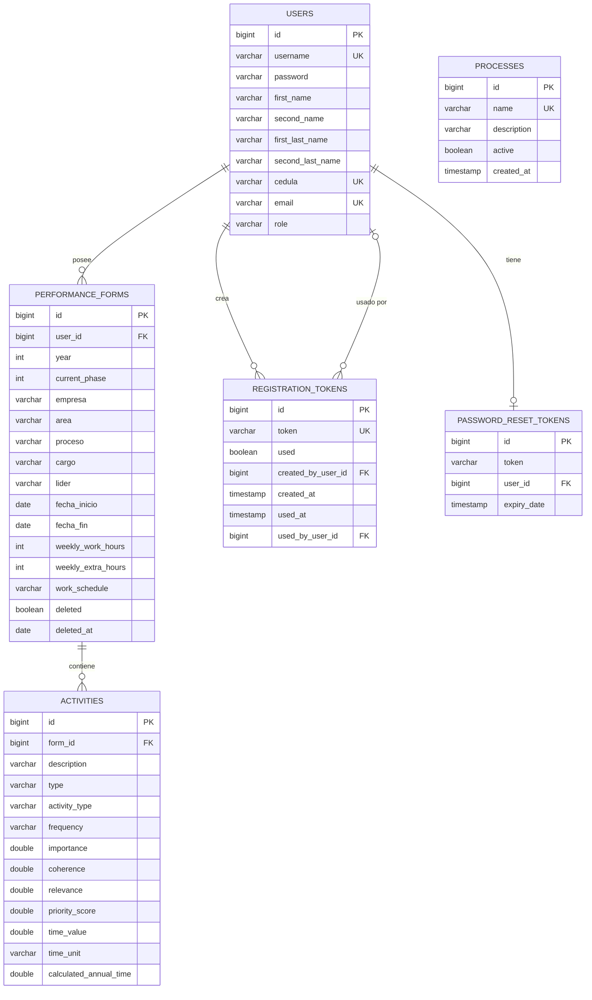

---

### 3.1 Muestreo de Datos

A continuación se presentan datos de ejemplo realistas que ilustran el funcionamiento del sistema para el contexto de la **Fundación Universitaria María Cano**.

#### 📊 Tabla: `users`

| id | username | firstName | secondName | firstLastName | secondLastName | cedula | email | role |
|---|---|---|---|---|---|---|---|---|
| 1 | admin | Carlos | Alberto | Martínez | López | 1017234567 | admin@fumc.edu.co | ADMIN |
| 2 | mgarcia | María | Fernanda | García | Ríos | 1020345678 | mgarcia@fumc.edu.co | LIDER |
| 3 | jrodriguez | Juan | Pablo | Rodríguez | Vélez | 1035456789 | jrodriguez@fumc.edu.co | USER |
| 4 | lcastro | Laura | — | Castro | Mejía | 1040567890 | lcastro@fumc.edu.co | USER |
| 5 | aperez | Andrés | Felipe | Pérez | Gutiérrez | 1025678901 | aperez@fumc.edu.co | USER |

---

#### 📊 Tabla: `processes`

| id | name | description | active | created_at |
|---|---|---|---|---|
| 1 | Gestión Académica | Procesos relacionados con la planificación, ejecución y evaluación académica | true | 2026-01-15 08:00:00 |
| 2 | Gestión Administrativa | Procesos de soporte administrativo y operativo de la institución | true | 2026-01-15 08:05:00 |
| 3 | Bienestar Universitario | Programas de bienestar y acompañamiento integral al estudiante | true | 2026-01-15 08:10:00 |
| 4 | Investigación | Procesos de investigación, innovación y producción intelectual | true | 2026-01-15 08:15:00 |
| 5 | Extensión y Proyección Social | Actividades de extensión, consultorios y proyección social | false | 2026-01-20 09:00:00 |

---

#### 📊 Tabla: `performance_forms`

| id | user_id | year | currentPhase | empresa | area | proceso | cargo | lider | fechaInicio | fechaFin | weeklyWorkHours | weeklyExtraHours | workSchedule | deleted |
|---|---|---|---|---|---|---|---|---|---|---|---|---|---|---|
| 1 | 3 | 2026 | 5 | FUMC | Rehabilitación | Gestión Académica | Docente Tiempo Completo | María F. García | 2026-01-15 | 2026-06-30 | 40 | 8 | Lunes a Viernes | false |
| 2 | 4 | 2026 | 3 | FUMC | Administrativa | Gestión Administrativa | Asistente Administrativa | Carlos A. Martínez | 2026-02-01 | 2026-07-31 | 48 | 5 | Lunes a Sábado | false |
| 3 | 5 | 2026 | 1 | FUMC | Investigación | Investigación | Investigador Junior | María F. García | 2026-03-01 | 2026-12-31 | 40 | 10 | Lunes a Viernes | false |
| 4 | 3 | 2025 | 5 | FUMC | Rehabilitación | Gestión Académica | Docente Tiempo Completo | María F. García | 2025-01-15 | 2025-06-30 | 40 | 8 | Lunes a Viernes | true |

---

#### 📊 Tabla: `activities` — Ejemplo para Formulario #1 (Juan Pablo Rodríguez, Fase 5 completada)

**Actividades Laborales:**

| id | form_id | description | type | activityType | frequency | importance | coherence | relevance | priorityScore | timeValue | timeUnit | calculatedAnnualTime |
|---|---|---|---|---|---|---|---|---|---|---|---|---|
| 1 | 1 | Preparación de clases de Fisioterapia | MISIONAL | LABORAL | Diaria | 5.0 | 4.5 | 4.0 | 4.65 | 120 | DIA | 30960 |
| 2 | 1 | Impartir clases presenciales | MISIONAL | LABORAL | Diaria | 5.0 | 5.0 | 5.0 | 5.00 | 240 | DIA | 61920 |
| 3 | 1 | Calificación de trabajos y exámenes | MISIONAL | LABORAL | Semanal | 4.0 | 4.0 | 3.5 | 3.90 | 300 | SEMANA | 15480 |
| 4 | 1 | Asesoría individual a estudiantes | ESTRATEGICA | LABORAL | Semanal | 3.5 | 3.0 | 4.0 | 3.45 | 120 | SEMANA | 6192 |
| 5 | 1 | Reuniones de coordinación académica | APOYO | LABORAL | Quincenal | 3.0 | 3.5 | 2.5 | 3.05 | 90 | QUINCENA | 2160 |
| 6 | 1 | Actualización de syllabus y contenidos | ESTRATEGICA | LABORAL | Mensual | 4.5 | 4.0 | 4.5 | 4.35 | 180 | MES | 2160 |
| 7 | 1 | Informes de gestión académica | APOYO | LABORAL | Trimestral | 2.5 | 3.0 | 2.0 | 2.55 | 480 | TRIMESTRE | 1920 |
| 8 | 1 | Participación en comités institucionales | APOYO | LABORAL | Mensual | 2.0 | 2.5 | 2.0 | 2.15 | 120 | MES | 1440 |

**Actividades Extralaborales:**

| id | form_id | description | type | activityType | frequency | importance | coherence | relevance | priorityScore | timeValue | timeUnit | calculatedAnnualTime |
|---|---|---|---|---|---|---|---|---|---|---|---|---|
| 9 | 1 | Investigación para publicación científica | ESTRATEGICA | EXTRALABORAL | Semanal | 4.5 | 4.0 | 5.0 | 4.45 | 180 | SEMANA | 9288 |
| 10 | 1 | Capacitación en nuevas técnicas de rehabilitación | ESTRATEGICA | EXTRALABORAL | Mensual | 4.0 | 3.5 | 4.5 | 3.95 | 240 | MES | 2880 |
| 11 | 1 | Trámites administrativos personales | APOYO | EXTRALABORAL | Mensual | 1.5 | 1.0 | 1.0 | 1.25 | 60 | MES | 720 |

**Lectura del muestreo — Formulario #1:**
- **Total de actividades**: 11 (8 laborales + 3 extralaborales)
- **Horas anuales laborales**: (30960+61920+15480+6192+2160+2160+1920+1440) / 60 = **2,037.2 hrs**
- **Horas anuales extralaborales**: (9288+2880+720) / 60 = **214.8 hrs**
- **Horas semanales laborales**: ~39.4 hrs/sem (dentro del límite de 40 hrs)
- **Actividad de mayor impacto**: "Impartir clases presenciales" — Prioridad Alta (5.00), 1,032 hrs anuales
- **Actividad de menor prioridad**: "Trámites administrativos personales" — Prioridad Baja (1.25)

---

#### 📊 Tabla: `registration_tokens`

| id | token | used | created_by_user_id | created_at | used_at | used_by_user_id |
|---|---|---|---|---|---|---|
| 1 | A1B2C3D4 | true | 1 | 2026-01-10 10:00:00 | 2026-01-12 14:30:00 | 3 |
| 2 | E5F6G7H8 | true | 1 | 2026-01-10 10:05:00 | 2026-01-15 09:15:00 | 4 |
| 3 | I9J0K1L2 | false | 2 | 2026-03-01 08:00:00 | — | — |
| 4 | M3N4O5P6 | false | 1 | 2026-04-15 16:00:00 | — | — |

---

#### 📊 Tabla: `password_reset_tokens`

| id | token | user_id | expiry_date |
|---|---|---|---|
| 1 | f47ac10b-58cc-4372 | 5 | 2026-04-20 15:30:00 |

---

## 4. Mapa de Historias de Usuario

El Mapa de Historias de Usuario (User Story Map) organiza las funcionalidades del sistema desde la perspectiva del **viaje del usuario**, agrupadas en **Épicas** (columnas) y priorizadas en **Releases** (filas).

### 4.1 Vista General del User Story Map

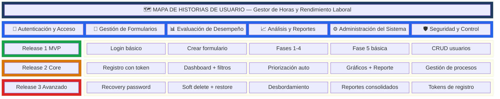

---

### 4.2 Detalle por Épica

---

#### 🔐 Épica 1: Autenticación y Acceso

| ID | Historia de Usuario | Release | Prioridad | Criterios de Aceptación |
|---|---|---|---|---|
| **HU-01** | Como **empleado**, quiero **iniciar sesión** con mi usuario y contraseña para **acceder al sistema de forma segura**. | R1 | 🔴 Alta | ✅ El sistema valida credenciales contra la BD |
| | | | | ✅ Se genera un token JWT al autenticarse |
| | | | | ✅ Si las credenciales son incorrectas, se muestra un mensaje de error |
| | | | | ✅ El token se almacena en el navegador |
| **HU-02** | Como **administrador**, quiero **registrar nuevos usuarios** mediante un código de invitación para **controlar quién accede al sistema**. | R2 | 🔴 Alta | ✅ Solo se puede registrar con un token válido y no usado |
| | | | | ✅ El token se marca como usado después del registro |
| | | | | ✅ Se solicitan: nombre, apellidos, cédula, email, usuario, contraseña |
| | | | | ✅ El nuevo usuario se crea con rol `USER` por defecto |
| **HU-03** | Como **empleado**, quiero **recuperar mi contraseña** por email cuando la olvide para **no depender del administrador**. | R3 | 🟡 Media | ✅ Se genera un token temporal de 15 minutos |
| | | | | ✅ Se envía un enlace de recuperación al email registrado |
| | | | | ✅ El enlace permite establecer una nueva contraseña |
| | | | | ✅ El token expira después de 15 minutos o después de usarse |

---

#### 📝 Épica 2: Gestión de Formularios

| ID | Historia de Usuario | Release | Prioridad | Criterios de Aceptación |
|---|---|---|---|---|
| **HU-04** | Como **empleado**, quiero **crear un nuevo formulario de evaluación** para **iniciar el proceso de análisis de mis actividades**. | R1 | 🔴 Alta | ✅ Se crea el formulario con el año actual y fase 1 |
| | | | | ✅ Se asocia automáticamente al usuario logueado |
| | | | | ✅ Se redirige al formulario recién creado |
| **HU-05** | Como **empleado**, quiero **ver mis formularios** en un dashboard con **indicadores de progreso** para **saber en qué estado está cada evaluación**. | R2 | 🔴 Alta | ✅ Se muestran los formularios paginados (8 por página) |
| | | | | ✅ Cada formulario muestra la fase actual con un indicador visual |
| | | | | ✅ Se puede filtrar entre "En Progreso" y "Finalizados" |
| | | | | ✅ Se pueden filtrar por año, área, proceso y fase |
| **HU-06** | Como **administrador**, quiero **eliminar formularios** de forma suave (soft delete) para **poder restaurarlos** si fue un error. | R3 | 🟡 Media | ✅ El formulario se marca como eliminado pero no se borra de la BD |
| | | | | ✅ Se registra la fecha de eliminación |
| | | | | ✅ Los formularios eliminados aparecen en una pestaña separada |
| | | | | ✅ Se pueden restaurar desde la vista de eliminados |
| **HU-07** | Como **administrador**, quiero **eliminar permanentemente** un formulario cuando ya no sea necesario. | R3 | 🟢 Baja | ✅ Solo disponible para rol ADMIN |
| | | | | ✅ Se muestra una confirmación doble antes de eliminar |
| | | | | ✅ La eliminación es irreversible |
| | | | | ✅ Se eliminan en cascada todas las actividades asociadas |
| **HU-08** | Como **líder**, quiero **previsualizar** un formulario rápidamente **sin necesidad de abrirlo completamente**. | R2 | 🟡 Media | ✅ Se abre un modal con la información resumida del formulario |
| | | | | ✅ Muestra encabezados, fase actual y cantidad de actividades |
| | | | | ✅ Se puede cerrar sin afectar la vista del dashboard |

---

#### 📊 Épica 3: Evaluación de Desempeño (Modelo de 5 Fases)

| ID | Historia de Usuario | Release | Prioridad | Criterios de Aceptación |
|---|---|---|---|---|
| **HU-09** | Como **empleado**, quiero **registrar los encabezados** de mi formulario (empresa, área, proceso, cargo, líder, fechas, horario) en la **Fase 1** para **contextualizar mi evaluación**. | R1 | 🔴 Alta | ✅ Todos los campos de encabezado son editables solo en Fase 1 |
| | | | | ✅ Se incluyen horas semanales laborales y extralaborales |
| | | | | ✅ La fecha de inicio se llena automáticamente con la fecha actual |
| | | | | ✅ El proceso se selecciona de una lista precargada |
| **HU-10** | Como **empleado**, quiero **registrar mis actividades** clasificándolas como Laborales o Extralaborales y por tipo (Estratégica, Misional, Apoyo) en la **Fase 1** para **categorizar correctamente mi trabajo**. | R1 | 🔴 Alta | ✅ Se pueden agregar actividades laborales (límite sugerido: 20) |
| | | | | ✅ Se pueden agregar actividades extralaborales (límite sugerido: 10) |
| | | | | ✅ Al superar el límite se muestra un aviso pero se permite continuar |
| | | | | ✅ Se pueden eliminar actividades individualmente |
| | | | | ✅ Se pueden mover actividades entre laborales y extralaborales |
| **HU-11** | Como **empleado**, quiero **establecer la frecuencia y unidad de tiempo** de cada actividad en la **Fase 2** para **indicar cada cuánto las realizo**. | R1 | 🔴 Alta | ✅ Se muestra la lista de actividades con campos de frecuencia |
| | | | | ✅ Se pueden seleccionar unidades: Día, Semana, Quincena, Mes, Trimestre, Semestre, Año |
| | | | | ✅ Se puede retroceder a Fase 1 para agregar más actividades |
| **HU-12** | Como **empleado**, quiero **evaluar la prioridad** de cada actividad con tres criterios (Importancia, Coherencia, Relevancia) en la **Fase 3** para **identificar cuáles son más relevantes**. | R1 | 🔴 Alta | ✅ Cada criterio se evalúa en escala de 0 a 5 |
| | | | | ✅ Se calcula automáticamente: Score = (Imp×0.50) + (Coh×0.30) + (Rel×0.20) |
| | | | | ✅ Se clasifica automáticamente: Alta (≥4.0), Media (≥2.5), Baja (<2.5) |
| | | | | ✅ No se puede retroceder a fases anteriores desde Fase 3 |
| **HU-13** | Como **empleado**, quiero **registrar el tiempo dedicado** a cada actividad en la **Fase 4** para **cuantificar mi carga de trabajo**. | R1 | 🔴 Alta | ✅ Se ingresa el valor en minutos por cada actividad |
| | | | | ✅ Se selecciona la unidad temporal (coherente con la frecuencia) |
| | | | | ✅ Se calcula automáticamente el tiempo anualizado usando los factores de conversión |
| **HU-14** | Como **empleado**, quiero **ver los resultados de mi evaluación** con gráficos y tablas en la **Fase 5** para **entender la distribución de mi tiempo**. | R1 | 🟡 Media | ✅ Pestaña Resumen: KPIs de total de actividades, horas anuales, análisis de carga |
| | | | | ✅ Pestaña Porcentajes: distribución porcentual por frecuencia y actividad |
| | | | | ✅ Pestaña Gráficos: gráficos de barras comparativos (laboral vs extralaboral) |
| | | | | ✅ Pestaña Detalle: tabla completa filtrable por tipo y prioridad |
| **HU-15** | Como **empleado**, quiero que el sistema **detecte automáticamente** cuando mis horas semanales superan el límite configurado para **visualizar el desbordamiento**. | R3 | 🔴 Alta | ✅ Se calcula el total de horas semanales a partir de las actividades |
| | | | | ✅ Se compara contra el límite definido en Fase 1 (weeklyWorkHours / weeklyExtraHours) |
| | | | | ✅ Se muestra una barra de progreso visual con código de color |
| | | | | ✅ Las actividades que causan el desbordamiento se marcan visualmente |
| **HU-16** | Como **administrador**, quiero **desbloquear un formulario** (volver a Fase 1) para **permitir correcciones** cuando sea necesario. | R2 | 🟡 Media | ✅ Solo disponible para rol ADMIN o LIDER |
| | | | | ✅ El formulario vuelve a Fase 1 |
| | | | | ✅ Todos los datos previos se conservan (no se borran) |
| | | | | ✅ Se muestra confirmación antes de desbloquear |

---

#### 📈 Épica 4: Análisis y Reportes

| ID | Historia de Usuario | Release | Prioridad | Criterios de Aceptación |
|---|---|---|---|---|
| **HU-17** | Como **líder**, quiero **ver un reporte consolidado** de todos los formularios completados para **analizar el rendimiento del equipo**. | R3 | 🔴 Alta | ✅ Se listan todos los formularios en Fase 5 |
| | | | | ✅ Se muestra el total de formularios y los incompletos |
| | | | | ✅ Se puede acceder al detalle de cada formulario |
| **HU-18** | Como **empleado**, quiero **imprimir un reporte profesional** de mi evaluación para **compartirlo con mi líder** en una reunión. | R2 | 🟡 Media | ✅ Se genera un documento HTML con formato A4 horizontal |
| | | | | ✅ Incluye: logo, encabezados, KPIs, tablas detalladas con prioridad e impacto |
| | | | | ✅ Incluye alerta de desbordamiento si aplica |
| | | | | ✅ Se abre en una nueva ventana del navegador lista para imprimir |

---

#### ⚙️ Épica 5: Administración del Sistema

| ID | Historia de Usuario | Release | Prioridad | Criterios de Aceptación |
|---|---|---|---|---|
| **HU-19** | Como **administrador**, quiero **gestionar los usuarios** del sistema (ver, promover, revocar permisos, eliminar) para **mantener control del acceso**. | R1 | 🔴 Alta | ✅ Lista de usuarios con búsqueda por nombre, usuario o cédula |
| | | | | ✅ Filtros por tipo: Todos, Administradores, Usuarios |
| | | | | ✅ Se puede promover un usuario a ADMIN |
| | | | | ✅ Se pueden revocar permisos de ADMIN a USER |
| | | | | ✅ Se puede eliminar un usuario con confirmación |
| **HU-20** | Como **administrador**, quiero **gestionar los procesos organizacionales** (crear, editar, activar/desactivar) para que **los empleados puedan asociar sus formularios a los procesos correctos**. | R2 | 🟡 Media | ✅ CRUD completo de procesos |
| | | | | ✅ Validación de nombre único |
| | | | | ✅ Soft delete (desactivación) en lugar de eliminación permanente |
| | | | | ✅ Solo los procesos activos aparecen disponibles en Fase 1 |
| **HU-21** | Como **administrador**, quiero **generar y gestionar tokens de registro** para **invitar nuevos usuarios al sistema de manera controlada**. | R3 | 🟡 Media | ✅ Se genera un código alfanumérico de 8 caracteres |
| | | | | ✅ Se puede copiar al portapapeles con un clic |
| | | | | ✅ Se muestra el estado (disponible/usado) y quién lo creó |
| | | | | ✅ Se pueden eliminar tokens no usados |

---

#### 🛡️ Épica 6: Seguridad y Control de Acceso

| ID | Historia de Usuario | Release | Prioridad | Criterios de Aceptación |
|---|---|---|---|---|
| **HU-22** | Como **sistema**, quiero **proteger todas las rutas** con guardias de autenticación y autorización para **evitar accesos no autorizados**. | R1 | 🔴 Alta | ✅ Las rutas protegidas redirigen a login si no hay sesión |
| | | | | ✅ Las rutas de admin solo son accesibles por ADMIN/LIDER |
| | | | | ✅ Las rutas de super-admin (formatos, usuarios, tokens) solo por ADMIN |
| | | | | ✅ Se incluye interceptor HTTP para adjuntar el token JWT automáticamente |
| **HU-23** | Como **sistema**, quiero **manejar el ciclo de vida** del token JWT para **cerrar sesión automáticamente** cuando expire. | R2 | 🟡 Media | ✅ El JWT se valida en cada request |
| | | | | ✅ Si el token expira, se redirige al login |
| | | | | ✅ El botón de logout limpia el token del almacenamiento local |

---

### 4.3 Roadmap de Releases

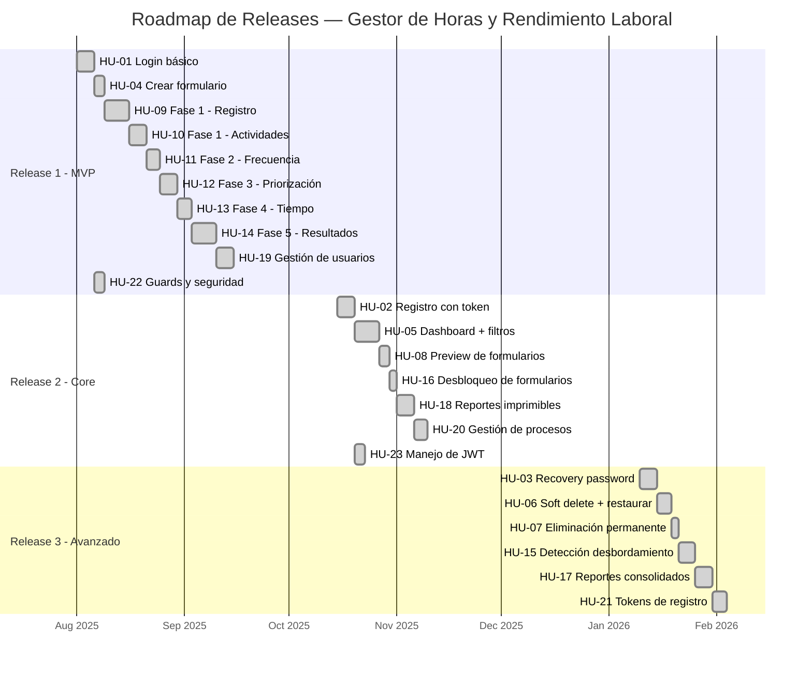

---

### 4.4 Resumen de Historias de Usuario por Release

| Release | Historias | Descripción |
|---|---|---|
| **R1 — MVP** | HU-01, HU-04, HU-09, HU-10, HU-11, HU-12, HU-13, HU-14, HU-19, HU-22 | Autenticación básica, flujo completo de 5 fases, gestión de usuarios y seguridad de rutas |
| **R2 — Core** | HU-02, HU-05, HU-08, HU-16, HU-18, HU-20, HU-23 | Registro controlado, dashboard con filtros y paginación, reportes imprimibles, gestión de procesos |
| **R3 — Avanzado** | HU-03, HU-06, HU-07, HU-15, HU-17, HU-21 | Recuperación de contraseña, soft delete, detección de sobrecarga, reportes consolidados, tokens de invitación |

---

**Total de Historias de Usuario: 23**
- 🔴 Prioridad Alta: 12 historias
- 🟡 Prioridad Media: 9 historias
- 🟢 Prioridad Baja: 2 historias
- Estado: ✅ Todas implementadas en el sistema actual

---

## 5. Modelo de Dominio Enriquecido

El **Modelo de Dominio Enriquecido** (Rich Domain Model) es un enfoque de diseño donde las entidades del dominio contienen tanto los **datos** como la **lógica de negocio** asociada. Las entidades son inteligentes: saben validarse, calcularse y transformarse a sí mismas.

### 5.1 Diagrama del Modelo Enriquecido

```mermaid
classDiagram
    direction TB

    class User {
        -Long id
        -String username
        -String password
        -String firstName
        -String secondName
        -String firstLastName
        -String secondLastName
        -String cedula
        -String email
        -String role
        +getFullName() String
        +isAdmin() boolean
        +isLider() boolean
        +canAccessAdminPanel() boolean
        +canManageUsers() boolean
        +canManageTokens() boolean
        +validateCredentials(password) boolean
        +changePassword(newPassword) void
        +promote(newRole) void
        +revokeAdmin() void
    }

    class PerformanceForm {
        -Long id
        -User user
        -int year
        -int currentPhase
        -String empresa
        -String area
        -String proceso
        -String cargo
        -String lider
        -LocalDate fechaInicio
        -LocalDate fechaFin
        -Integer weeklyWorkHours
        -Integer weeklyExtraHours
        -String workSchedule
        -Boolean deleted
        -LocalDate deletedAt
        -List~Activity~ activities
        +canEditHeaders() boolean
        +canAddActivities() boolean
        +canAdvancePhase() boolean
        +canRegressPhase() boolean
        +advancePhase() void
        +regressPhase() void
        +unlock() void
        +softDelete() void
        +restore() void
        +isCompleted() boolean
        +isDeleted() boolean
        +getLaboralActivities() List~Activity~
        +getExtralaboralActivities() List~Activity~
        +getTotalLaboralWeeklyHours() double
        +getTotalExtralaboralWeeklyHours() double
        +hasLaboralOverflow() boolean
        +hasExtralaboralOverflow() boolean
        +getLaboralOverflowHours() double
        +getProgressPercentage() int
    }

    class Activity {
        -Long id
        -PerformanceForm form
        -String description
        -String type
        -String activityType
        -String frequency
        -Double importance
        -Double coherence
        -Double relevance
        -Double priorityScore
        -Double timeValue
        -String timeUnit
        -Double calculatedAnnualTime
        +calculatePriority() void
        +calculateAnnualTime() double
        +calculateTimeInUnit(unit) double
        +getPriorityLabel() String
        +getPriorityClass() String
        +isLaboral() boolean
        +isExtralaboral() boolean
        +isHighPriority() boolean
        +isMediumPriority() boolean
        +isLowPriority() boolean
        +getImpactPercentage(totalTime) double
        +moveToType(newType) void
        +validateForPhase(phase) boolean
    }

    class Process {
        -Long id
        -String name
        -String description
        -Boolean active
        -LocalDateTime createdAt
        +activate() void
        +deactivate() void
        +isActive() boolean
        +validateUniqueName(existingNames) boolean
    }

    class RegistrationToken {
        -Long id
        -String token
        -Boolean used
        -User createdBy
        -LocalDateTime createdAt
        -LocalDateTime usedAt
        -User usedBy
        +generate() void
        +markAsUsed(user) void
        +isAvailable() boolean
        +isExpired() boolean
    }

    class PasswordResetToken {
        -Long id
        -String token
        -User user
        -LocalDateTime expiryDate
        +isExpired() boolean
        +validate() boolean
        +generateCode() String
    }

    User "1" --> "*" PerformanceForm
    PerformanceForm "1" --> "*" Activity
    User "1" --> "*" RegistrationToken
    PasswordResetToken "1" --> "1" User
```

### 5.2 Comportamientos Clave del Modelo Enriquecido

| Entidad | Comportamiento | Descripción | Regla de Negocio |
|---|---|---|---|
| **PerformanceForm** | `canEditHeaders()` | Retorna `true` solo si `currentPhase == 1` | Los encabezados son inmutables después de Fase 1 |
| **PerformanceForm** | `canAddActivities()` | Retorna `true` si `currentPhase <= 2` | Solo se agregan/eliminan actividades en Fases 1-2 |
| **PerformanceForm** | `canRegressPhase()` | Retorna `true` solo si `currentPhase == 2` | Solo se retrocede de Fase 2 a Fase 1 |
| **PerformanceForm** | `hasLaboralOverflow()` | Compara horas semanales laborales vs límite | Detecta sobrecarga laboral automáticamente |
| **PerformanceForm** | `softDelete()` | Marca `deleted=true` y registra `deletedAt` | No elimina datos, permite restauración |
| **Activity** | `calculatePriority()` | Score = (Imp×0.50)+(Coh×0.30)+(Rel×0.20) | Cálculo automático de prioridad ponderada |
| **Activity** | `calculateAnnualTime()` | `timeValue × factor` según unidad | Anualiza el tiempo con factores de conversión |
| **Activity** | `getPriorityLabel()` | Alta (≥4.0), Media (≥2.5), Baja (<2.5) | Clasificación semántica del score |
| **Activity** | `moveToType(newType)` | Cambia entre LABORAL y EXTRALABORAL | Permite recategorizar actividades en Fase 1 |
| **RegistrationToken** | `markAsUsed(user)` | Marca como usado y registra quién/cuándo | Token de un solo uso |
| **PasswordResetToken** | `isExpired()` | Verifica si `expiryDate < now()` | Vence en 15 minutos |

### 5.3 Ventajas del Modelo Enriquecido en este Proyecto

| Ventaja | Aplicación en el Proyecto |
|---|---|
| **Encapsulamiento** | La lógica de cálculo de prioridades y tiempos está dentro de `Activity`, no dispersa en servicios |
| **Validación intrínseca** | `PerformanceForm` conoce sus propias restricciones de fase (cuándo se puede avanzar, retroceder, editar) |
| **Cohesión** | Cada entidad agrupa datos + comportamiento relacionado, facilitando el mantenimiento |
| **Reducción de servicios** | Los servicios se vuelven orquestadores delgados que delegan la lógica al dominio |

---

## 6. Modelo de Dominio Anémico

El **Modelo de Dominio Anémico** (Anemic Domain Model) es el enfoque **actualmente implementado** en el proyecto. Las entidades son simples contenedores de datos (POJOs/DTOs) con getters y setters, mientras que toda la lógica de negocio reside en los **servicios**.

### 6.1 Diagrama del Modelo Anémico (Implementación Actual)

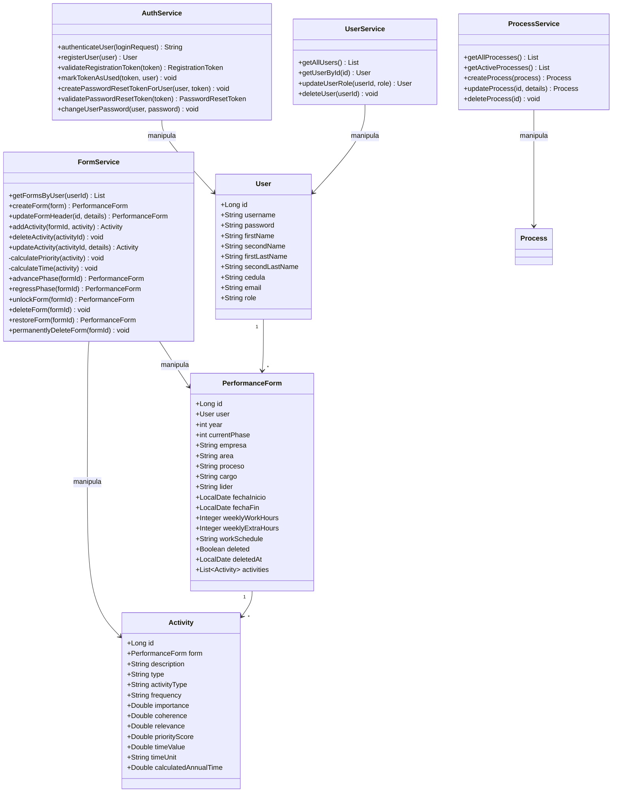

### 6.2 Comparación: Modelo Anémico vs Enriquecido

| Aspecto | Modelo Anémico (Implementado) | Modelo Enriquecido (Ideal) |
|---|---|---|
| **Ubicación de la lógica** | En las clases `Service` (FormService, AuthService, etc.) | Dentro de las entidades del dominio |
| **Entidades** | Solo datos (getters/setters con `@Data` de Lombok) | Datos + comportamiento + validaciones |
| **Cálculo de prioridad** | `FormService.calculatePriority(activity)` | `activity.calculatePriority()` |
| **Cálculo de tiempo** | `FormService.calculateTime(activity)` | `activity.calculateAnnualTime()` |
| **Validación de fase** | `if (form.getCurrentPhase() != 1)` en FormService | `form.canEditHeaders()` retorna boolean |
| **Avance de fase** | `FormService.advancePhase(formId)` con lógica externa | `form.advancePhase()` con reglas internas |
| **Soft delete** | `FormService.deleteForm(formId)` manipula flags | `form.softDelete()` encapsula la operación |
| **Testabilidad** | Requiere mockear repositorios para probar lógica | Se pueden probar reglas directamente en la entidad |
| **Complejidad de servicios** | Servicios grandes con mucha lógica | Servicios delgados que orquestan |

### 6.3 ¿Por qué se usó el Modelo Anémico?

El modelo anémico es el patrón más común en aplicaciones **Spring Boot** porque:

1. **Convención del framework**: Spring Boot favorece la separación Service/Repository/Entity
2. **Simplicidad inicial**: Facilita el desarrollo rápido en etapas tempranas
3. **Compatibilidad con JPA**: Las entidades JPA funcionan mejor como contenedores de datos puros
4. **Familiaridad del equipo**: Es el patrón más enseñado en cursos de Spring

> **Recomendación para futuras iteraciones**: Migrar gradualmente la lógica de cálculo (`calculatePriority`, `calculateTime`) y validación (`canEditHeaders`, `canAddActivities`) hacia las entidades del dominio para mejorar la cohesión y testabilidad.

---

## 7. Event Storming

El **Event Storming** es una técnica de modelado colaborativo que identifica los **eventos de dominio** (cosas que suceden en el sistema), los **comandos** que los provocan, los **actores** que los ejecutan y las **políticas** que se aplican.

### 7.1 Flujo General de Eventos del Sistema

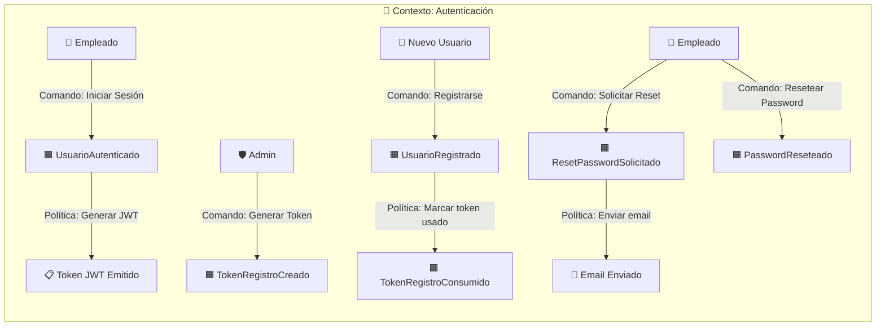

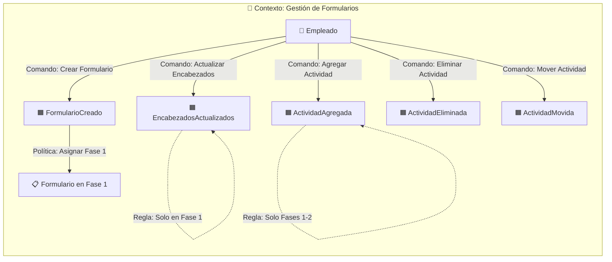

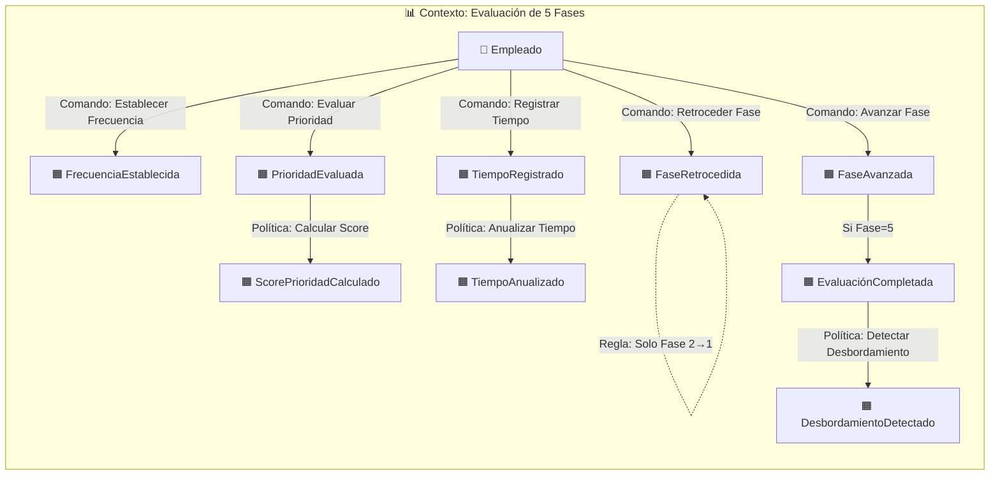

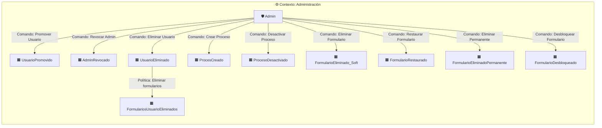

### 7.2 Catálogo de Eventos de Dominio

| # | Evento de Dominio | Comando Disparador | Actor | Contexto | Política/Regla Asociada |
|---|---|---|---|---|---|
| 1 | `UsuarioAutenticado` | Iniciar Sesión | Empleado | Autenticación | Generar token JWT |
| 2 | `TokenRegistroCreado` | Generar Token de Registro | Admin | Autenticación | Código UUID de 8 caracteres |
| 3 | `UsuarioRegistrado` | Registrarse con Token | Nuevo Usuario | Autenticación | Username auto-generado, rol USER por defecto |
| 4 | `TokenRegistroConsumido` | (automático tras registro) | Sistema | Autenticación | Token se elimina de la BD |
| 5 | `ResetPasswordSolicitado` | Solicitar Recuperación | Empleado | Autenticación | Enviar código de 6 dígitos por email |
| 6 | `PasswordReseteado` | Resetear Contraseña | Empleado | Autenticación | Validar código, encriptar nueva contraseña |
| 7 | `FormularioCreado` | Crear Formulario | Empleado | Formularios | Asignar año actual, fase 1, deleted=false |
| 8 | `EncabezadosActualizados` | Actualizar Encabezados | Empleado | Formularios | Solo permitido en Fase 1 |
| 9 | `ActividadAgregada` | Agregar Actividad | Empleado | Formularios | Alerta si > 20 laborales o > 10 extralaborales |
| 10 | `ActividadEliminada` | Eliminar Actividad | Empleado | Formularios | Solo hasta Fase 2 |
| 11 | `ActividadMovida` | Mover Actividad (Lab↔Extralab) | Empleado | Formularios | Actualiza `activityType` |
| 12 | `FrecuenciaEstablecida` | Establecer Frecuencia | Empleado | Evaluación | Fase 2: frecuencia y unidad de tiempo |
| 13 | `PrioridadEvaluada` | Evaluar Prioridad | Empleado | Evaluación | Fase 3: importancia, coherencia, relevancia |
| 14 | `ScorePrioridadCalculado` | (automático) | Sistema | Evaluación | Score = (I×0.50)+(C×0.30)+(R×0.20) |
| 15 | `TiempoRegistrado` | Registrar Tiempo | Empleado | Evaluación | Fase 4: valor + unidad |
| 16 | `TiempoAnualizado` | (automático) | Sistema | Evaluación | Multiplica por factor de conversión |
| 17 | `FaseAvanzada` | Avanzar Fase | Empleado | Evaluación | `currentPhase++` si < 5 |
| 18 | `FaseRetrocedida` | Retroceder Fase | Empleado | Evaluación | Solo de Fase 2 → Fase 1 |
| 19 | `EvaluaciónCompletada` | Avanzar a Fase 5 | Empleado | Evaluación | Dashboard analítico disponible |
| 20 | `DesbordamientoDetectado` | (automático en Fase 5) | Sistema | Evaluación | Horas semanales > límite configurado |
| 21 | `UsuarioPromovido` | Promover a Admin | Admin | Administración | Cambia rol a ADMIN |
| 22 | `AdminRevocado` | Revocar Admin | Admin | Administración | Cambia rol a USER |
| 23 | `UsuarioEliminado` | Eliminar Usuario | Admin | Administración | Elimina usuario + sus formularios en cascada |
| 24 | `ProcesoCreado` | Crear Proceso | Admin | Administración | Validar nombre único |
| 25 | `ProcesoDesactivado` | Desactivar Proceso | Admin | Administración | Soft delete: `active=false` |
| 26 | `FormularioEliminado_Soft` | Eliminar Formulario | Admin | Administración | `deleted=true`, registra fecha |
| 27 | `FormularioRestaurado` | Restaurar Formulario | Admin | Administración | `deleted=false`, limpia fecha |
| 28 | `FormularioEliminadoPermanente` | Eliminación Permanente | Admin | Administración | Borra de la BD irreversiblemente |
| 29 | `FormularioDesbloqueado` | Desbloquear Formulario | Admin | Administración | `currentPhase=1`, conserva datos |

### 7.3 Agregados Identificados

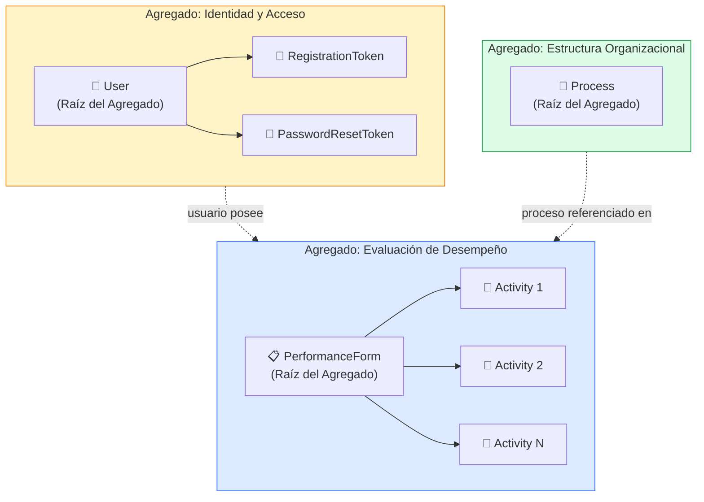

---

## 8. Tallaje del Producto

El **Tallaje del Producto** (Product Sizing) estima el esfuerzo relativo de cada historia de usuario usando la escala de **Puntos de Historia** (Story Points) con la secuencia de Fibonacci modificada: 1, 2, 3, 5, 8, 13.

### 8.1 Criterios de Estimación

| Puntos | Complejidad | Ejemplo de Referencia |
|---|---|---|
| **1** | Trivial | Cambio de etiqueta, ajuste de estilo |
| **2** | Simple | Endpoint GET básico sin lógica |
| **3** | Moderada | CRUD simple con validación |
| **5** | Considerable | Formulario con lógica de negocio y validaciones múltiples |
| **8** | Compleja | Flujo multi-paso con cálculos y restricciones |
| **13** | Muy Compleja | Dashboard analítico con gráficos, cálculos y múltiples vistas |

### 8.2 Tallaje por Historia de Usuario

| ID | Historia de Usuario | Puntos | Justificación |
|---|---|---|---|
| **HU-01** | Login con JWT | **3** | Autenticación estándar con generación de token |
| **HU-02** | Registro con token de invitación | **5** | Validación de token + generación automática de username + múltiples validaciones |
| **HU-03** | Recuperación de contraseña | **5** | Generación de código + envío de email + validación temporal |
| **HU-04** | Crear formulario | **2** | Creación simple con valores por defecto |
| **HU-05** | Dashboard con filtros y paginación | **8** | Vista compleja con filtros, pestañas, paginación y roles diferenciados |
| **HU-06** | Soft delete de formularios | **3** | Lógica de flags + vista de eliminados |
| **HU-07** | Eliminación permanente | **2** | Endpoint simple con confirmación |
| **HU-08** | Preview de formularios | **3** | Modal con resumen de datos |
| **HU-09** | Fase 1 — Encabezados | **5** | Formulario con múltiples campos + lista de procesos + validación de fase |
| **HU-10** | Fase 1 — Actividades | **8** | Dos listas separadas + drag and drop + límites sugeridos + categorización |
| **HU-11** | Fase 2 — Frecuencia | **3** | Lista de actividades con campos de selección |
| **HU-12** | Fase 3 — Priorización | **5** | Tres criterios por actividad + cálculo automático ponderado |
| **HU-13** | Fase 4 — Tiempo | **5** | Registro de tiempo + cálculo de anualización con 7 unidades diferentes |
| **HU-14** | Fase 5 — Resultados | **13** | Dashboard con 4 pestañas, gráficos Chart.js, tablas filtrables, KPIs |
| **HU-15** | Detección de desbordamiento | **8** | Cálculo de horas semanales vs límite + marcado visual de actividades excedentes |
| **HU-16** | Desbloqueo de formularios | **2** | Endpoint con autorización |
| **HU-17** | Reportes consolidados | **5** | Vista administrativa con métricas globales |
| **HU-18** | Reportes imprimibles | **8** | Generación de HTML complejo con estilos inline, tablas, barras de impacto |
| **HU-19** | Gestión de usuarios | **5** | CRUD + búsqueda + filtros por rol + acciones de promover/revocar |
| **HU-20** | Gestión de procesos | **3** | CRUD estándar con validación de nombre único |
| **HU-21** | Tokens de registro | **3** | Generación + listado + copiar al portapapeles |
| **HU-22** | Guards y seguridad | **5** | AuthGuard + AdminGuard + SuperAdminGuard + Interceptor HTTP |
| **HU-23** | Manejo de ciclo de vida JWT | **2** | Validación de token en cada request |

### 8.3 Resumen de Tallaje

| Métrica | Valor |
|---|---|
| **Total de Story Points** | **111 puntos** |
| **Promedio por historia** | 4.8 puntos |
| **Historia más grande** | HU-14 (Fase 5 — Resultados): 13 puntos |
| **Historias más pequeñas** | HU-04, HU-07, HU-16, HU-23: 2 puntos cada una |
| **Distribución** | Triviales (2 pts): 4 · Simples (3 pts): 6 · Moderadas (5 pts): 8 · Complejas (8 pts): 4 · Muy Complejas (13 pts): 1 |

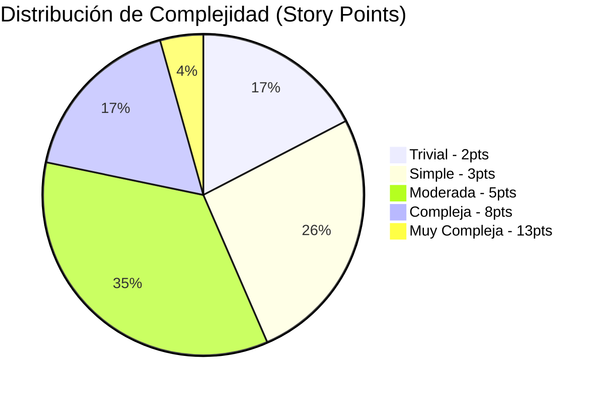

---

## 9. Plan de Liberaciones

El **Plan de Liberaciones** (Release Plan) define la planificación temporal de cada release, la velocidad del equipo y los sprints necesarios para entregar cada incremento.

### 9.1 Parámetros del Equipo

| Parámetro | Valor |
|---|---|
| **Tamaño del equipo** | 2-3 desarrolladores |
| **Duración del sprint** | 2 semanas |
| **Velocidad estimada** | 18-22 puntos por sprint |
| **Velocidad promedio usada** | 20 puntos/sprint |

### 9.2 Release 1 — MVP (Producto Mínimo Viable)

| Campo | Valor |
|---|---|
| **Objetivo** | Entregar el flujo completo de evaluación de 5 fases con autenticación básica |
| **Story Points totales** | 51 puntos |
| **Sprints necesarios** | 3 sprints (6 semanas) |
| **Fecha inicio** | 1 de agosto 2025 |
| **Fecha fin** | 12 de septiembre 2025 |

| Sprint | Historias | Puntos | Foco |
|---|---|---|---|
| **Sprint 1** | HU-01 (3), HU-22 (5), HU-04 (2), HU-09 (5), HU-10 (8) | **23** | Autenticación + Fase 1 completa |
| **Sprint 2** | HU-11 (3), HU-12 (5), HU-13 (5), HU-19 (5) | **18** | Fases 2-4 + Gestión usuarios |
| **Sprint 3** | HU-14 (13) | **13** | Fase 5 (resultados con gráficos) |

---

### 9.3 Release 2 — Core (Funcionalidades Centrales)

| Campo | Valor |
|---|---|
| **Objetivo** | Dashboard profesional, reportes, gestión de procesos y registro controlado |
| **Story Points totales** | 32 puntos |
| **Sprints necesarios** | 2 sprints (4 semanas) |
| **Fecha inicio** | 15 de octubre 2025 |
| **Fecha fin** | 11 de noviembre 2025 |

| Sprint | Historias | Puntos | Foco |
|---|---|---|---|
| **Sprint 4** | HU-02 (5), HU-23 (2), HU-05 (8), HU-08 (3) | **18** | Registro con token + Dashboard |
| **Sprint 5** | HU-16 (2), HU-18 (8), HU-20 (3) | **13** | Reportes imprimibles + Procesos |

---

### 9.4 Release 3 — Avanzado (Funcionalidades Avanzadas)

| Campo | Valor |
|---|---|
| **Objetivo** | Recuperación de contraseña, detección de sobrecarga, soft delete, reportes consolidados |
| **Story Points totales** | 28 puntos |
| **Sprints necesarios** | 2 sprints (4 semanas) |
| **Fecha inicio** | 10 de enero 2026 |
| **Fecha fin** | 6 de febrero 2026 |

| Sprint | Historias | Puntos | Foco |
|---|---|---|---|
| **Sprint 6** | HU-03 (5), HU-06 (3), HU-07 (2), HU-15 (8) | **18** | Recovery + Soft delete + Desbordamiento |
| **Sprint 7** | HU-17 (5), HU-21 (3) | **8** | Reportes consolidados + Tokens de registro |

### 9.5 Burndown por Release

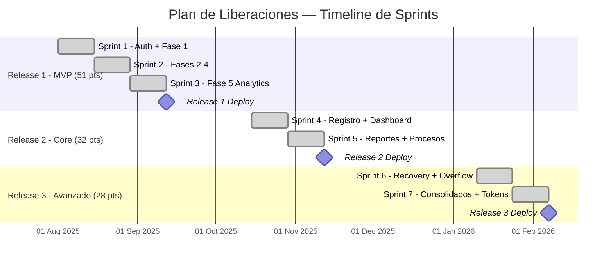

### 9.6 Resumen del Plan de Liberaciones

| Release | Sprints | Story Points | Duración | Historias | Estado |
|---|---|---|---|---|---|
| **R1 — MVP** | 3 | 51 pts | 6 semanas | HU-01, HU-04, HU-09, HU-10, HU-11, HU-12, HU-13, HU-14, HU-19, HU-22 | ✅ Completado |
| **R2 — Core** | 2 | 32 pts | 4 semanas | HU-02, HU-05, HU-08, HU-16, HU-18, HU-20, HU-23 | ✅ Completado |
| **R3 — Avanzado** | 2 | 28 pts | 4 semanas | HU-03, HU-06, HU-07, HU-15, HU-17, HU-21 | ✅ Completado |
| **TOTAL** | **7** | **111 pts** | **14 semanas** | 23 historias | ✅ Todo completado |

---

## 10. Especificación Funcional

La **Especificación Funcional** detalla los requisitos funcionales del sistema organizados por módulo, incluyendo las API REST, las reglas de negocio y los flujos de interacción.

### 10.1 Módulo de Autenticación

#### RF-01: Inicio de Sesión

| Campo | Descripción |
|---|---|
| **Descripción** | El sistema permite a los usuarios autenticarse mediante usuario y contraseña |
| **Actor** | Empleado, Líder, Administrador |
| **Precondición** | El usuario debe estar registrado en el sistema |
| **Postcondición** | Se genera un token JWT y se redirige al dashboard |

**API Endpoint:**

| Método | Ruta | Body | Respuesta |
|---|---|---|---|
| `POST` | `/api/auth/login` | `{ username, password }` | `{ accessToken, userId, role, fullName }` |

**Reglas de negocio:**
- La contraseña se valida contra el hash BCrypt almacenado
- El token JWT contiene el username como subject
- El frontend almacena el token en `localStorage`

---

#### RF-02: Registro de Usuarios

| Campo | Descripción |
|---|---|
| **Descripción** | Permite registrar nuevos usuarios mediante un código de invitación |
| **Actor** | Nuevo usuario (con código proporcionado por un admin) |
| **Precondición** | Poseer un código de registro válido y no utilizado |
| **Postcondición** | Usuario creado con rol USER y username auto-generado |

**API Endpoint:**

| Método | Ruta | Body | Respuesta |
|---|---|---|---|
| `POST` | `/api/auth/register` | `{ registrationToken, firstName, secondName, firstLastName, secondLastName, cedula, email, password }` | `{ message, username, id }` |

**Reglas de negocio:**
- Username generado: `nombre.apellido{últimos4Cedula}` en minúsculas
- Si el username existe, se agrega un sufijo numérico incremental
- Se valida unicidad de cédula y email
- El token de registro se elimina tras el uso

---

#### RF-03: Recuperación de Contraseña

| Campo | Descripción |
|---|---|
| **Descripción** | Permite recuperar la contraseña mediante un código enviado por email |
| **Actor** | Empleado que olvidó su contraseña |
| **Precondición** | El usuario debe existir y tener email registrado |
| **Postcondición** | Contraseña actualizada, token de reset eliminado |

**API Endpoints:**

| Método | Ruta | Body | Respuesta |
|---|---|---|---|
| `POST` | `/api/auth/request-password-reset` | `{ contact: username }` | `{ message }` |
| `POST` | `/api/auth/reset-password` | `{ code, newPassword }` | `{ message }` |

**Reglas de negocio:**
- Se genera un código de 6 dígitos aleatorio
- El código tiene vigencia de 15 minutos
- Se envía al email registrado del usuario
- Si ya existe un token previo, se actualiza (no se duplica)

---

### 10.2 Módulo de Formularios de Evaluación

#### RF-04: Gestión de Formularios

**API Endpoints:**

| Método | Ruta | Autorización | Descripción |
|---|---|---|---|
| `GET` | `/api/forms/user/{userId}?page=0&size=8&filter=progress` | Auth | Listar formularios del usuario (paginado) |
| `GET` | `/api/forms/{id}/user/{userId}` | Auth | Obtener formulario con actividades |
| `POST` | `/api/forms` | Auth | Crear nuevo formulario |
| `PUT` | `/api/forms/{id}/header` | Auth | Actualizar encabezados (solo Fase 1) |
| `DELETE` | `/api/forms/{id}` | ADMIN | Soft delete de formulario |
| `GET` | `/api/forms/deleted?page=0&size=8` | ADMIN/LIDER | Listar formularios eliminados |
| `POST` | `/api/forms/{id}/restore` | ADMIN | Restaurar formulario eliminado |
| `DELETE` | `/api/forms/{id}/permanent` | ADMIN | Eliminación permanente |

---

#### RF-05: Gestión de Actividades

**API Endpoints:**

| Método | Ruta | Autorización | Descripción |
|---|---|---|---|
| `POST` | `/api/forms/{id}/activities` | Auth | Agregar actividad (Fases 1-2) |
| `PUT` | `/api/forms/activities/{activityId}` | Auth | Actualizar actividad (según fase) |
| `DELETE` | `/api/forms/activities/{activityId}` | Auth | Eliminar actividad (Fases 1-2) |

**Reglas por fase para actualización de actividades:**

| Fase | Campos editables |
|---|---|
| Fase 1 | `description`, `type`, `activityType` |
| Fase 2 | `frequency`, `timeUnit` |
| Fase 3 | `importance`, `coherence`, `relevance` → calcula `priorityScore` |
| Fase 4 | `timeValue`, `timeUnit` → calcula `calculatedAnnualTime` |
| Fase 5 | No editable (solo lectura) |

---

#### RF-06: Control de Fases

**API Endpoints:**

| Método | Ruta | Autorización | Descripción |
|---|---|---|---|
| `POST` | `/api/forms/{id}/advance` | Auth | Avanzar a la siguiente fase |
| `POST` | `/api/forms/{id}/regress` | Auth | Retroceder fase (solo 2→1) |
| `POST` | `/api/forms/{id}/unlock` | ADMIN | Desbloquear (volver a Fase 1) |

**Diagrama de transición de fases:**

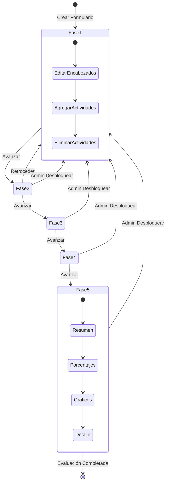

---

### 10.3 Módulo de Administración

#### RF-07: Gestión de Usuarios

**API Endpoints:**

| Método | Ruta | Autorización | Descripción |
|---|---|---|---|
| `GET` | `/api/users` | ADMIN | Listar todos los usuarios |
| `PUT` | `/api/users/{id}/role` | ADMIN | Cambiar rol de usuario |
| `DELETE` | `/api/users/{id}` | ADMIN | Eliminar usuario y sus datos |

**Reglas de negocio:**
- Al eliminar un usuario se eliminan todos sus formularios en cascada
- Los tokens de registro creados por el usuario se desvinculan (createdBy = null)
- Los tokens usados por el usuario se desvinculan (usedBy = null)

---

#### RF-08: Gestión de Procesos

**API Endpoints:**

| Método | Ruta | Autorización | Descripción |
|---|---|---|---|
| `GET` | `/api/processes` | Auth | Listar todos los procesos |
| `GET` | `/api/processes/active` | Auth | Listar procesos activos (para Fase 1) |
| `POST` | `/api/processes` | ADMIN | Crear proceso |
| `PUT` | `/api/processes/{id}` | ADMIN | Actualizar proceso |
| `DELETE` | `/api/processes/{id}` | ADMIN | Desactivar proceso (soft delete) |

---

#### RF-09: Gestión de Tokens de Registro

**API Endpoints:**

| Método | Ruta | Autorización | Descripción |
|---|---|---|---|
| `GET` | `/api/admin/tokens` | ADMIN | Listar todos los tokens |
| `POST` | `/api/admin/tokens/generate` | ADMIN | Generar nuevo token |
| `DELETE` | `/api/admin/tokens/{id}` | ADMIN | Eliminar token no usado |

---

### 10.4 Módulo de Reportes

#### RF-10: Reportes Consolidados

**API Endpoints:**

| Método | Ruta | Autorización | Descripción |
|---|---|---|---|
| `GET` | `/api/forms/consolidated` | ADMIN | Obtener todos los formularios |
| `GET` | `/api/forms/completed` | ADMIN | Obtener formularios completados (Fase 5) |

#### RF-11: Reporte Imprimible

| Campo | Descripción |
|---|---|
| **Formato** | HTML con estilos inline, optimizado para impresión A4 horizontal |
| **Contenido** | Logo, encabezados, KPIs (4 tarjetas), alerta de desbordamiento, tablas detalladas (laboral + extralaboral) con prioridad, horas anuales y barra de impacto |
| **Generación** | Se abre en nueva ventana del navegador con `window.open()` y `window.print()` |

### 10.5 Requisitos No Funcionales

| ID | Requisito | Descripción | Implementación |
|---|---|---|---|
| **RNF-01** | Seguridad | Autenticación basada en tokens JWT | Spring Security + JWT |
| **RNF-02** | Encriptación | Las contraseñas deben almacenarse encriptadas | BCrypt mediante PasswordEncoder |
| **RNF-03** | Autorización | Control de acceso basado en roles (RBAC) | Guards en Angular + @PreAuthorize en Spring |
| **RNF-04** | Paginación | Las listas deben ser paginadas para rendimiento | Spring Data Pageable (8 elementos/página) |
| **RNF-05** | Soft Delete | Los formularios eliminados deben ser recuperables | Flag `deleted` + `deletedAt` |
| **RNF-06** | Responsividad | La interfaz debe funcionar en diferentes tamaños de pantalla | CSS responsive en Angular |
| **RNF-07** | Persistencia | Los datos deben persistir en base de datos relacional | PostgreSQL 16+ con JPA/Hibernate |
| **RNF-08** | Despliegue | La aplicación debe desplegarse en Apache Tomcat | WAR (backend) + archivos estáticos (frontend) |

---

## 11. Índice de Figuras

A continuación se presenta el inventario completo de todas las figuras (diagramas) incluidas en este documento.

| # | Figura | Tipo de Diagrama | Sección | Descripción |
|---|---|---|---|---|
| **Fig. 1** | Mapa de Impacto General | Mermaid Mindmap | §2.1 | Diagrama jerárquico que conecta el objetivo de negocio con actores, impactos y entregables |
| **Fig. 2** | Diagrama de Clases del Dominio | Mermaid Class Diagram | §3.1 | Modelo de dominio con 6 entidades, atributos y relaciones |
| **Fig. 3** | Diagrama Entidad-Relación | Mermaid ER Diagram | §3.3 | Modelo relacional con PKs, FKs, tipos de datos y cardinalidades |
| **Fig. 4** | User Story Map — Vista General | Mermaid Block Diagram | §4.1 | Mapa de historias organizado por épicas (columnas) y releases (filas) |
| **Fig. 5** | Roadmap de Releases | Mermaid Gantt | §4.3 | Diagrama Gantt con timeline de las 23 HU en 3 releases |
| **Fig. 6** | Modelo de Dominio Enriquecido | Mermaid Class Diagram | §5.1 | Diagrama de clases con métodos de comportamiento en cada entidad |
| **Fig. 7** | Modelo de Dominio Anémico | Mermaid Class Diagram | §6.1 | Diagrama que muestra entidades sin lógica + servicios con toda la lógica |
| **Fig. 8** | Event Storming — Autenticación | Mermaid Flowchart | §7.1 | Flujo de eventos del contexto de autenticación |
| **Fig. 9** | Event Storming — Formularios | Mermaid Flowchart | §7.1 | Flujo de eventos del contexto de gestión de formularios |
| **Fig. 10** | Event Storming — Evaluación 5 Fases | Mermaid Flowchart | §7.1 | Flujo de eventos del contexto de evaluación secuencial |
| **Fig. 11** | Event Storming — Administración | Mermaid Flowchart | §7.1 | Flujo de eventos del contexto de administración del sistema |
| **Fig. 12** | Agregados del Dominio | Mermaid Flowchart | §7.3 | Diagrama de agregados DDD con raíces y entidades hijas |
| **Fig. 13** | Distribución de Complejidad | Mermaid Pie Chart | §8.3 | Gráfico circular de distribución de story points por complejidad |
| **Fig. 14** | Timeline de Sprints | Mermaid Gantt | §9.5 | Diagrama Gantt del plan de liberaciones con 7 sprints |
| **Fig. 15** | Transición de Fases | Mermaid State Diagram | §10.2 | Diagrama de estados del ciclo de vida de un formulario |
| **Fig. 16** | Ciclo de Vida del Software | Mermaid Flowchart | §12.1 | Diagrama del SDLC iterativo e incremental del proyecto |
| **Fig. 17** | Marco Scrum Adaptado | Mermaid Flowchart | §13.2 | Flujo de trabajo de la metodología ágil utilizada |

> **Total de figuras: 17 diagramas**

---

## 12. Ciclo de Vida del Software

### 12.1 Modelo de Ciclo de Vida: Iterativo e Incremental

El proyecto adoptó un **ciclo de vida iterativo e incremental**, donde el sistema se construyó a lo largo de múltiples iteraciones (sprints), entregando incrementos funcionales al final de cada una.

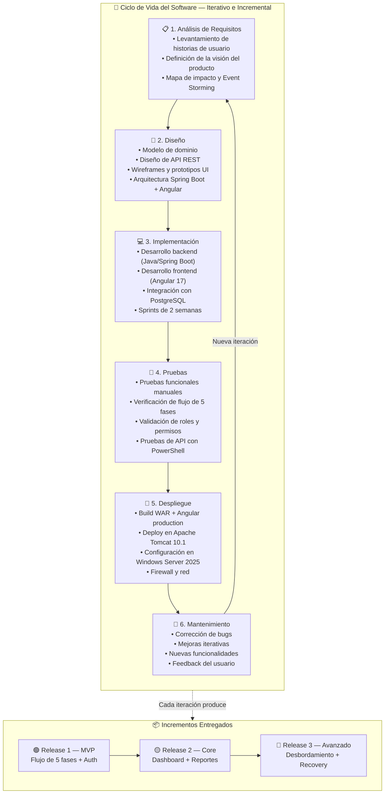

### 12.2 Fases del Ciclo de Vida Aplicadas

| Fase | Actividades Realizadas | Artefactos Generados |
|---|---|---|
| **1. Análisis** | Levantamiento de requisitos con el cliente (FUMC), definición de la visión, identificación de actores y procesos organizacionales | Visión del producto, Mapa de impacto, Historias de usuario, Event Storming |
| **2. Diseño** | Diseño del modelo de dominio (6 entidades), diseño de la API REST (5 controllers, 28+ endpoints), diseño del flujo de 5 fases, arquitectura de 3 capas | Modelo de dominio, Diagrama ER, Especificación de API, Prototipos |
| **3. Implementación** | Desarrollo del backend en Spring Boot 3.2.3 con Java 17, frontend en Angular 17 con standalone components, integración con PostgreSQL | Código fuente (backend + frontend), configuraciones de despliegue |
| **4. Pruebas** | Pruebas funcionales del flujo completo de 5 fases, validación de roles (USER, LIDER, ADMIN), pruebas de API con PowerShell/Invoke-WebRequest | Checklist de verificación, resultados de pruebas |
| **5. Despliegue** | Compilación WAR + Angular production build, despliegue en Apache Tomcat 10.1 sobre Windows Server 2025, configuración de firewall | Guía de despliegue, WAR file, archivos estáticos |
| **6. Mantenimiento** | Corrección de bugs (CORS, timezone, drag-and-drop), mejoras de UX (notificaciones, paginación), adición de features (soft delete, desbordamiento) | Commits de corrección, nuevas versiones |

### 12.3 Justificación del Modelo Elegido

| Criterio | Justificación |
|---|---|
| **¿Por qué iterativo?** | El proyecto requería retroalimentación constante del cliente (FUMC) para validar que el modelo de 5 fases cumplía con las necesidades de evaluación del desempeño |
| **¿Por qué incremental?** | Se entregaron 3 incrementos funcionales (MVP → Core → Avanzado) para que el cliente pudiera usar el sistema desde etapas tempranas |
| **¿Por qué no cascada?** | Los requisitos evolucionaron durante el desarrollo (ej: se agregó la detección de desbordamiento y el soft delete basado en feedback del cliente) |
| **¿Por qué no prototipado puro?** | El proyecto tenía requisitos suficientemente claros para planificar releases, no era necesario un enfoque exploratorio |

---

## 13. Metodología Ágil

### 13.1 Metodología Utilizada: Scrum Adaptado

El proyecto utilizó **Scrum adaptado** como metodología ágil, manteniendo los eventos y artefactos principales de Scrum pero con adaptaciones para un equipo pequeño (2-3 personas).

### 13.2 Marco de Trabajo

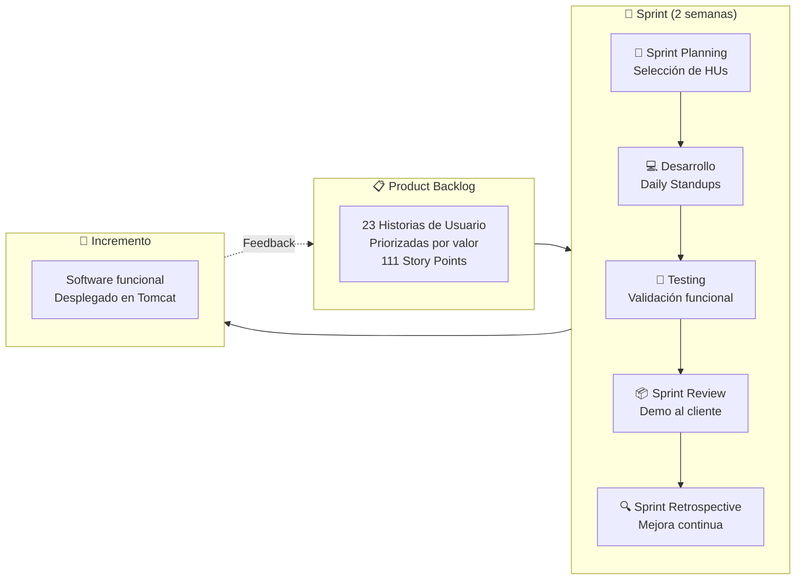

### 13.3 Roles de Scrum

| Rol | Responsable | Responsabilidades en el Proyecto |
|---|---|---|
| **Product Owner** | Representante de FUMC (Fundación Universitaria María Cano) | Definir la visión, priorizar el backlog, validar entregas, dar feedback sobre el modelo de 5 fases |
| **Scrum Master** | Miembro del equipo de desarrollo | Facilitar las ceremonias, remover impedimentos, asegurar que el equipo sigue las prácticas ágiles |
| **Development Team** | Equipo de 2-3 desarrolladores | Diseñar, desarrollar, probar y desplegar el software |

### 13.4 Eventos de Scrum

| Evento | Frecuencia | Duración | Descripción |
|---|---|---|---|
| **Sprint Planning** | Inicio de cada sprint | 1-2 horas | Selección de historias del backlog, estimación en story points, definición del sprint goal |
| **Daily Standup** | Diario | 15 minutos | Sincronización del equipo: qué hice ayer, qué haré hoy, hay impedimentos |
| **Sprint Review** | Fin de cada sprint | 1 hora | Demostración del incremento funcional al Product Owner, recopilación de feedback |
| **Sprint Retrospective** | Fin de cada sprint | 30 minutos | Reflexión del equipo: qué salió bien, qué mejorar, acciones de mejora |

### 13.5 Artefactos de Scrum

| Artefacto | Descripción | Herramienta |
|---|---|---|
| **Product Backlog** | Lista priorizada de 23 historias de usuario con criterios de aceptación | Documento de requisitos |
| **Sprint Backlog** | Subconjunto de historias seleccionadas para el sprint actual (18-23 pts) | Tablero de tareas |
| **Incremento** | Software funcional desplegado al final de cada sprint | Apache Tomcat (Windows Server 2025) |
| **Definition of Done** | Criterios que una historia debe cumplir para considerarse terminada | Ver abajo |

### 13.6 Definition of Done (DoD)

Una historia de usuario se considera **DONE** cuando cumple todos los siguientes criterios:

| # | Criterio | Descripción |
|---|---|---|
| 1 | ✅ **Código completo** | Backend (Spring Boot) y frontend (Angular) implementados |
| 2 | ✅ **API funcional** | Endpoints probados con respuestas correctas |
| 3 | ✅ **UI funcional** | Interfaz de usuario operativa y navegable |
| 4 | ✅ **Validaciones** | Reglas de negocio implementadas y verificadas |
| 5 | ✅ **Seguridad** | Guards y @PreAuthorize configurados según rol |
| 6 | ✅ **Pruebas manuales** | Flujo completo probado sin errores |
| 7 | ✅ **Desplegable** | El build genera WAR y archivos estáticos sin errores |
| 8 | ✅ **Revisado** | Código revisado por al menos un miembro del equipo |

### 13.7 Adaptaciones de Scrum para el Proyecto

| Práctica Estándar de Scrum | Adaptación Aplicada | Razón |
|---|---|---|
| Sprint de 2-4 semanas | **Sprints de 2 semanas** | Equipo pequeño, entregas frecuentes |
| Equipo de 3-9 personas | **Equipo de 2-3 personas** | Proyecto académico / de grado |
| Burndown chart formal | **Seguimiento simple de puntos** | Menor overhead administrativo |
| Daily standup presencial | **Comunicación continua** | Equipo co-localizado/remoto pequeño |
| Herramientas como Jira | **Documentación en Markdown + Git** | Simplicidad y accesibilidad |
| Sprint Review formal | **Demo al Product Owner** | Feedback directo del cliente FUMC |

### 13.8 Métricas del Proyecto

| Métrica | Valor |
|---|---|
| **Total de Sprints** | 7 |
| **Duración total del proyecto** | ~14 semanas (3.5 meses de desarrollo activo) |
| **Velocidad promedio** | 15.9 pts/sprint |
| **Story Points entregados** | 111 puntos |
| **Historias completadas** | 23/23 (100%) |
| **Releases entregados** | 3 |
| **Defectos corregidos** | Múltiples (CORS, timezone, drag-and-drop, paginación) |

---

*Documento generado el 4 de junio de 2026*
*Proyecto: Gestor de Horas y Rendimiento Laboral — FUMC*
*Versión: 2.0 — Documentación ampliada*
